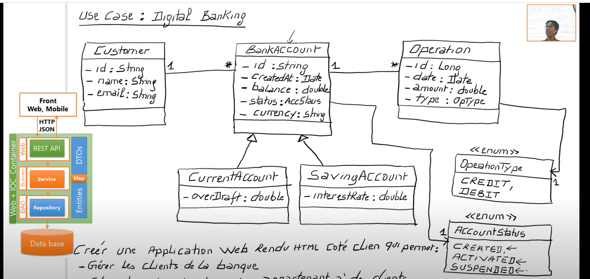

Travail à faire :
1. Créer un projet Spring Boot avec les dépendances Web, Spring Data JPA, H2, Lombok
2. Créer l'entité JPA Compte
3. Créer l'interface CompteRepository basée sur Spring Data
4. Tester la couche DAO
5. Créer le Web service Restfull qui permet de gérer des comptes
6. Tester le web micro-service en utilisant un client REST comme Postman
7. Générer et tester le documentation Swagger de des API Rest du Web service
8. Exposer une API Restful en utilisant Spring Data Rest en exploitant des projections
9. Créer les DTOs et Mappers
10. Créer la couche Service (métier) et du micro service

//////////////////////////////////////////////////

//////////////////////////////////////////////////

Key components of a microservices architecture include:

<b>Core Services:</b> Each service is a self-contained unit of functionality that can be developed, tested, and deployed independently of the other services.

<b>Service registry:</b> A service registry is a database of all the services in the system, along with their locations and capabilities. It allows services to discover and communicate with each other.

<b>API Gateway:</b> An API gateway is a single entry point for all incoming requests to the microservices. It acts as a reverse proxy, routing requests to the appropriate service and handling tasks such as authentication and rate limiting.

<b>Message bus:</b> A message bus is a messaging system that allows services to communicate asynchronously with each other. This can be done through protocols like HTTP, RabbitMQ, or Kafka.

<b>Monitoring and logging:</b> Monitoring and logging are necessary to track the health of the services and troubleshoot problems.

<b>Service discovery and load balancing: </b>This component is responsible for discovering service instances and directing traffic to the appropriate service instances based on load and availability.

<b>Continuous integration and continuous deployment (CI/CD):</b> To make the development and deployment process of microservices as smooth as possible, it is recommended to use a tool such as Jenkins, TravisCI, or CircleCI to automate the process of building, testing, and deploying microservices.